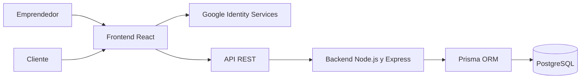

# EmprendeBot — Frontend

[](https://react.dev/)
[](https://www.typescriptlang.org/)
[](https://vite.dev/)
[](https://reactrouter.com/)
[](https://nodejs.org/)
[](https://www.postgresql.org/)
[](https://www.prisma.io/)

<p align="center">
  
</p>

**EmprendeBot** es una plataforma web que permite a emprendedores configurar un asistente comercial, publicar productos y servicios, administrar preguntas frecuentes, recibir consultas y ofrecer un chatbot público mediante un enlace único para su negocio.

El frontend está construido como una SPA con React, TypeScript y Vite. Consume una API REST desarrollada con Node.js y Express, conectada a PostgreSQL mediante Prisma.

## Contenido

- [Características principales](#características-principales)
- [Flujo general](#flujo-general)
- [Experiencia de Usuario (UX/UI)](#experiencia-de-usuario-uxui)
- [Tecnologías](#tecnologías)
- [Requisitos](#requisitos)
- [Instalación](#instalación)
- [Variables de entorno](#variables-de-entorno)
- [Ejecución local](#ejecución-local)
- [Scripts](#scripts)
- [Rutas](#rutas)
- [Arquitectura](#arquitectura)
- [Integración con el backend](#integración-con-el-backend)
- [Autenticación](#autenticación)
- [Generación del enlace público](#generación-del-enlace-público)
- [Persistencia local](#persistencia-local)
- [Integraciones](#integraciones)
- [Build y despliegue](#build-y-despliegue)
- [Solución de problemas](#solución-de-problemas)
- [Documentación adicional](#documentación-adicional)
- [Estado del proyecto](#estado-del-proyecto)

## Características principales

- Registro e inicio de sesión con email y contraseña.
- Inicio de sesión con Google Identity Services.
- Configuración de los datos y la identidad del negocio.
- Carga de logo con validación de formato y tamaño.
- Generación automática de un slug único.
- Personalización del enlace público disponible una única vez.
- Catálogo de productos y servicios con precio fijo o a convenir.
- Administración de preguntas frecuentes y categorías.
- Normalización y prevención de preguntas frecuentes duplicadas.
- Dashboard para centralizar la actividad comercial.
- Indicadores reales de consultas, presupuestos, conversiones y automatización estimada.
- Actividad reciente combinada desde consultas y presupuestos.
- Listado, detalle y actualización de consultas.
- Clasificación visual de consultas atendidas por el bot o que requieren seguimiento.
- Acceso rápido a WhatsApp desde los datos de contacto.
- Chatbot público accesible mediante el enlace del negocio.
- Solicitud, generación, seguimiento y descarga de presupuestos.
- Captura de nombre y teléfono para presupuestos y derivaciones.
- Pantalla de métricas con actividad semanal, estados de presupuestos y tasa de conversión.
- Temas claro y oscuro con preferencia persistente.

<!--
## Capturas de pantalla

Agregar aquí capturas representativas del dashboard, la configuración del negocio y el chat público.
-->

## Flujo general

1. El emprendedor crea una cuenta o ingresa con Google.
2. Configura los datos de su negocio y la identidad del asistente.
3. El sistema genera un enlace público único.
4. El emprendedor carga su catálogo y organiza las preguntas frecuentes.
5. Los clientes acceden al chatbot mediante el enlace compartido.
6. El chatbot responde utilizando la información configurada.
7. Las consultas y los datos de contacto quedan registrados.
8. Los presupuestos automáticos se generan cuando todos los productos tienen precio; las cotizaciones pendientes quedan disponibles para seguimiento.
9. El emprendedor administra consultas, presupuestos, métricas y actividad reciente desde su panel.


## Experiencia de Usuario (UX/UI)

La experiencia de usuario y la interfaz de EmprendeBot fueron diseñadas con el objetivo de ofrecer una herramienta simple, intuitiva y accesible para emprendedores, priorizando una navegación clara y una interacción guiada en cada etapa del proceso.

El diseño se desarrolló íntegramente en Figma, utilizando componentes reutilizables, Auto Layout, variantes, variables y prototipos interactivos, permitiendo mantener la consistencia visual y facilitando la implementación del proyecto.

Durante el desarrollo se trabajó de forma iterativa, definiendo flujos, arquitectura de la información, pantallas y componentes que evolucionaron a medida que avanzaba el proyecto, integrando las necesidades de los usuarios con la viabilidad técnica del desarrollo.

Las principales interfaces diseñadas incluyen:

- Onboarding e inicio de sesión.
- Registro y configuración del negocio.
- Dashboard principal.
- Catálogo de productos y servicios.
- Gestión de consultas y presupuestos.
- Administración de preguntas frecuentes.
- Configuración del asistente.
- Chatbot para clientes.

Como parte del proceso de UX/UI, también se implementaron interfaces en un entorno de desarrollo propio para validar los diseños directamente sobre el código, realizar los ajustes necesarios y facilitar su integración al proyecto principal.

Este trabajo permitió mantener la coherencia entre el diseño y la aplicación desarrollada, acompañando la evolución del producto desde su concepción en Figma hasta su implementación en el Frontend.

### Recursos de diseño

El archivo de Figma documenta la evolución completa del proyecto, incluyendo investigación, exploración de ideas, wireframes, flujos, prototipos, componentes, iteraciones y versiones previas del diseño.

🔗 **Prototipo y proceso de diseño en Figma:** https://www.figma.com/design/ML5s4dnzzXyFI0wkwd5AVN/InnovaLab-equipo-16?node-id=24-111&t=GW8pB3Ki0qWEY2dB-1

## Tecnologías

| Tecnología | Uso |
| --- | --- |
| React 19 | Interfaz y composición de componentes |
| TypeScript 6 | Tipado estático |
| Vite 8 | Desarrollo y build |
| React Router 7 | Enrutamiento SPA |
| `@react-oauth/google` | Inicio de sesión con Google |
| ESLint | Análisis estático |
| CSS | Tokens, temas y estilos globales |

## Requisitos

- Node.js compatible con Vite 8. Se recomienda Node.js 20.19 o superior.
- npm.
- Backend de EmprendeBot instalado y ejecutándose.
- Una base PostgreSQL accesible por el backend.
- Un OAuth Client ID de Google si se habilitará el acceso con Google.

## Instalación

Desde la carpeta del frontend:

```bash
npm install
```

El repositorio no versiona archivos `.env`. Para desarrollo se recomienda crear `.env.local`
y configurar las variables indicadas debajo. El proveedor de despliegue debe definir las mismas
variables durante el build de producción.

No deben subirse secretos al repositorio.
Las variables `VITE_*` son públicas y se incorporan al bundle del navegador.

## Variables de entorno

### `VITE_API_URL`

URL base de la API, incluyendo el prefijo `/api`.

```env
VITE_API_URL=http://localhost:3000/api
```

La variable es obligatoria. Si falta o no contiene una URL HTTP/HTTPS válida, la aplicación
detiene el inicio con un error de configuración en lugar de conectarse a un fallback.

En producción debe reemplazarse por la URL vigente del backend desplegado, conservando el
prefijo `/api`.

### `VITE_GOOGLE_CLIENT_ID`

Client ID público de Google OAuth utilizado por `GoogleOAuthProvider`.

```env
VITE_GOOGLE_CLIENT_ID=000000000000-xxxxxxxxxxxxxxxx.apps.googleusercontent.com
```

El mismo Client ID debe estar configurado en el backend como `GOOGLE_CLIENT_ID`. Los orígenes autorizados en Google Cloud deben incluir las URLs exactas desde las que se sirve el frontend, por ejemplo:

```text
http://localhost:5173
https://frontend.ejemplo.com
```

> Las variables cuyo nombre comienza con `VITE_` quedan disponibles en el bundle del navegador. Nunca deben contener secretos.

## Ejecución local

### 1. Levantar el backend

En otra terminal:

```bash
cd ../chatbot-innova-backend
npm run dev
```

El backend local debe quedar disponible en:

```text
http://localhost:3000
```

### 2. Levantar el frontend

```bash
npm run dev
```

Vite mostrará la URL local, normalmente:

```text
http://localhost:5173
```

## Scripts

| Comando | Descripción |
| --- | --- |
| `npm run dev` | Inicia Vite en modo desarrollo con recarga rápida |
| `npm run build` | Ejecuta TypeScript y genera el bundle de producción |
| `npm run lint` | Ejecuta ESLint sobre el proyecto |
| `npm run preview` | Sirve localmente el build generado en `dist/` |

El proyecto no define actualmente un script `typecheck` independiente. `npm run build`
ya ejecuta `tsc -b`; para comprobar únicamente los tipos se puede usar:

```bash
npx tsc --noEmit
```

Antes de entregar cambios se recomienda ejecutar:

```bash
npm run lint
npm run build
```

## Rutas

| Ruta | Acceso | Descripción |
| --- | --- | --- |
| `/` | Público | Splash inicial |
| `/presentacion` | Público | Presentación y opciones de acceso |
| `/login` | Público | Inicio de sesión |
| `/registro` | Público | Creación de cuenta |
| `/configurar` | Protegido | Alta y edición del negocio y del bot |
| `/dashboard` | Protegido | Panel principal del emprendedor |
| `/consultas` | Protegido | Listado y detalle de consultas |
| `/presupuestos` | Protegido | Listado y filtros de presupuestos |
| `/presupuestos/:id` | Protegido | Detalle, estado, PDF y cotización de un presupuesto |
| `/metricas` | Protegido | Indicadores y evolución de consultas y presupuestos |
| `/faq` | Protegido | Administración de FAQ y categorías |
| `/catalogo` | Protegido | Catálogo de productos y servicios |
| `/catalogo/agregar` | Protegido | Alta de producto o servicio |
| `/catalogo/editar/:id` | Protegido | Edición de producto o servicio |
| `/:slug` | Público | Chat público de un negocio |

Las rutas privadas se protegen mediante `ProtectedRoute`. Si no existe un usuario autenticado, la navegación se reemplaza por `/login`.

## Arquitectura

```text
src/
├── components/
│   ├── chat/          Componentes de conversación pública
│   ├── consultas/     Tarjetas y detalle de consultas
│   ├── dashboard/     Tarjetas del Dashboard y actividad reciente
│   ├── faq/           Formularios y tarjetas de FAQ
│   ├── layout/        Navegación lateral
│   └── ui/            Componentes visuales reutilizables
├── context/
│   ├── AuthContext.tsx       Sesión, login y registro
│   ├── BusinessContext.tsx   Negocio activo y operaciones asociadas
│   └── ThemeContext.tsx      Tema claro/oscuro
├── hooks/
│   ├── useChat.ts            Flujo conversacional
│   ├── useConsultas.ts       Estado de consultas
│   ├── useDashboardStats.ts  Resumen y actividad del Dashboard
│   ├── useFaqs.ts            Gestión de FAQ
│   └── useTheme.ts           Acceso al tema
├── pages/              Pantallas asociadas a rutas
├── services/
│   ├── apiClient.ts            Cliente HTTP central
│   ├── faqApi.ts               API privada de FAQ
│   ├── faqCategoryApi.ts       API de categorías
│   ├── publicApi.ts            API pública de FAQ
│   ├── publicConsultationApi.ts API pública de consultas
│   ├── presupuestoApi.ts       API privada de presupuestos
│   ├── productApi.ts           API privada del catálogo
│   └── *Storage.ts             Persistencia de datos en el navegador
├── features/           Módulos de interfaz con alcance propio, como Métricas
├── styles/             Identidad visual
├── types/              Tipos compartidos
├── utils/              Formateadores y clasificación derivada
├── App.tsx             Definición de rutas
├── main.tsx            Providers y montaje de React
└── index.css           Tokens y estilos globales
```

### Providers

La aplicación se monta con esta jerarquía:

```text
BrowserRouter
└── GoogleOAuthProvider
    └── ThemeProvider
        └── AuthProvider
            └── BusinessProvider
                └── App
```

- `AuthProvider` mantiene el usuario y el JWT.
- `BusinessProvider` sincroniza el negocio del usuario y limpia el estado al cambiar de cuenta.
- `ThemeProvider` conserva la preferencia visual.

## Integración con el backend

Todas las solicitudes pasan por `src/services/apiClient.ts`.

El cliente:

- Usa `VITE_API_URL` como URL base.
- Agrega `Content-Type: application/json` salvo que el cuerpo sea `FormData`.
- Adjunta `Authorization: Bearer <token>` en endpoints privados.
- Permite desactivar autenticación con `{ auth: false }`.
- Convierte respuestas HTTP fallidas en errores con un mensaje legible.

Ejemplo privado:

```ts
await apiRequest('/bot', {
  method: 'PUT',
  body: JSON.stringify({ nombreNegocio: 'Mi negocio' }),
})
```

Ejemplo público:

```ts
await apiRequest('/public/chatbot/mi-negocio/faqs', {
  auth: false,
})
```

### Endpoints principales utilizados

| Área | Endpoints |
| --- | --- |
| Autenticación | `/auth/register`, `/auth/login`, `/auth/google` |
| Bot | `/bot`, `/bot/config`, `/bot/slug`, `/bot/rubros` |
| FAQ | `/faqs`, `/faqs/:id` |
| Categorías | `/faq-categories`, `/faq-categories/:id` |
| Catálogo | `/products`, `/products/:id` |
| Consultas privadas | `/consultations`, `/consultations/:id/estado` y consultas derivadas |
| Presupuestos privados | `/presupuestos`, `/presupuestos/:id`, `/presupuestos/:id/estado`, `/presupuestos/:id/cotizar` |
| Chat público | `/public/chatbot/:slug/init`, FAQ, productos, consultas, mensajes y contacto |
| Presupuesto público | `/public/chatbot/:slug/consultations/:id/budgets` |
| Historial público | `/mensajes/:slug/:sessionId` |

### Consultas y resolución visual

El backend entrega estados técnicos `nueva`, `en_proceso`, `resuelta` y `cerrada`. El frontend
también calcula una clasificación visual centralizada mediante señales reales disponibles:

- derivación explícita;
- mensajes o cierre del emprendedor;
- presupuesto relacionado;
- tipo de consulta;
- datos de contacto;
- cobertura completa del listado de presupuestos.

Cuando no existe ninguna señal de intervención, la interfaz puede mostrar **Resuelta por el bot**
y ocultar las acciones manuales. Esta clasificación no modifica el estado persistido ni genera
un `PATCH` automático. Si la información es incompleta, se aplica una clasificación conservadora.

### Dashboard y métricas

El Dashboard combina la información de consultas y presupuestos para mostrar indicadores clave y los cinco movimientos más recientes.

La **Automatización estimada** se calcula en frontend:

```text
consultas clasificadas como resueltas por el bot / total de consultas × 100
```

El Dashboard calcula automáticamente este indicador utilizando la información disponible.

La **Tasa de conversión** de Métricas representa:

```text
presupuestos con estado CONCRETADO / total de presupuestos × 100
```

Estas mediciones son derivadas de las entidades actuales; no constituyen un historial de auditoría
de todas las transiciones.

## Autenticación

Después del login, el frontend guarda:

```text
eb_auth_token
eb_current_user
```

El JWT se envía en los endpoints protegidos. Al cerrar sesión se eliminan ambos valores y `BusinessProvider` limpia el negocio activo para impedir que una cuenta nueva herede información visual de la cuenta anterior.

### Google

`GoogleLogin` obtiene una credencial de Google y la envía a:

```http
POST /api/auth/google
```

La credencial se verifica en el backend. El nombre personal de Google no debe utilizarse automáticamente como nombre del negocio.

## Generación del enlace público

El flujo esperado es:

1. Se crea la cuenta del emprendedor.
2. El bot inicial queda sin `nombreNegocio` y sin `slug`.
3. El emprendedor completa la configuración.
4. El backend genera un slug único usando el nombre real del negocio.
5. El frontend presenta la URL como `${window.location.origin}/${slug}`.

Ejemplo:

```text
Nombre personal: Juan Pérez
Nombre del negocio: Pastelería Dulce
Enlace público: https://frontend.ejemplo.com/pasteleria-dulce
```

Si el slug ya existe, el backend agrega un sufijo numérico. El emprendedor puede personalizarlo una vez desde Configuración.

## Persistencia local

El MVP utiliza `localStorage` y `sessionStorage` para complementar la API.

| Clave o grupo | Contenido |
| --- | --- |
| `eb_auth_token` | JWT de la sesión |
| `eb_current_user` | Usuario autenticado |
| `eb_businesses` | Datos de negocios asociados a los usuarios del navegador |
| Preferencia de tema | Tema claro u oscuro |
| `emprendebot:session:<slug>` | Identificador anónimo usado para recuperar una conversación pública |
| Historial del chat | Copia visual de mensajes mostrados en ese navegador |
| Estado del chat | Etapa local activa del flujo conversacional |
| `emprendebot:consultas:*` | Consultas de demostración o compatibilidad local |
| `emprendebot:consulta:<slug>` | ID de consulta pública durante la pestaña actual |

Las consultas y presupuestos se obtienen desde la API. El almacenamiento local se utiliza para conservar la experiencia del usuario entre sesiones del navegador.

No se deben almacenar secretos en estas claves.

## Integraciones

| Módulo | Integración |
| --- | --- |
| Registro e inicio de sesión | API REST |
| Inicio de sesión con Google | Google Identity Services y API REST |
| Configuración del negocio | API REST |
| Logo | API mediante `FormData` |
| Slug y enlace público | API REST |
| Preguntas frecuentes y categorías | API REST |
| Catálogo | API REST |
| Consultas | API REST |
| Presupuestos y PDF | API REST |
| Chat público | API REST y estado visual en el navegador |
| Historial de conversación | API REST y copia visual local |
| Tema visual | Navegador |

## Build y despliegue

Generar el build:

```bash
npm run build
```

La salida se escribe en:

```text
dist/
```

Probar el resultado localmente:

```bash
npm run preview
```

### Reescritura de rutas SPA

El proyecto incluye `public/_redirects`:

```text
/* /index.html 200
```

Esto permite que rutas como `/dashboard` o `/mi-negocio` funcionen al abrirse directamente en plataformas compatibles con este formato, como Netlify.

En otros proveedores debe configurarse una regla equivalente para enviar las rutas desconocidas a `index.html`.

### Variables en producción

El proveedor debe definir los valores públicos durante el build:

```env
VITE_API_URL=https://url-publica-del-backend/api
VITE_GOOGLE_CLIENT_ID=client-id-de-google
```

Las variables de Vite se incorporan durante el build. Después de modificarlas es necesario volver a desplegar.

## Solución de problemas

### `ERR_CONNECTION_REFUSED` hacia el puerto 3000

El frontend no encuentra el backend local.

Comprobar:

```bash
cd ../chatbot-innova-backend
npm run dev
```

También verificar que `VITE_API_URL` incluya `/api`.

### Error de CORS

La URL exacta del frontend debe estar permitida en la configuración CORS del backend. El protocolo, dominio y puerto deben coincidir.

### Google muestra `origin is not allowed`

Agregar la URL del frontend en **Authorized JavaScript origins** dentro de Google Cloud Console y comprobar que frontend y backend utilicen el mismo Client ID.

### El backend responde `401`

- Comprobar que exista `eb_auth_token`.
- Volver a iniciar sesión si el JWT expiró.
- Verificar que `VITE_API_URL` apunte al entorno correcto.

### Los cambios del `.env` no aparecen

Detener y volver a iniciar Vite:

```bash
npm run dev
```

## Documentación adicional

- `COMPONENTS.md`: inventario visual y convenciones de componentes.
- `src/App.tsx`: rutas disponibles.
- `src/services/apiClient.ts`: comportamiento del cliente HTTP.
- Repositorio backend: API, Prisma, autenticación y servicios públicos.

## Estado del proyecto

EmprendeBot corresponde al MVP funcional desarrollado para InnovaLab.

El sistema integra autenticación, configuración del negocio, catálogo de productos y servicios, preguntas frecuentes, gestión de consultas, presupuestos y un chatbot público conectado mediante una API REST.

La arquitectura fue diseñada para facilitar el mantenimiento del código y permitir futuras ampliaciones del producto sin modificar la estructura principal del sistema.
